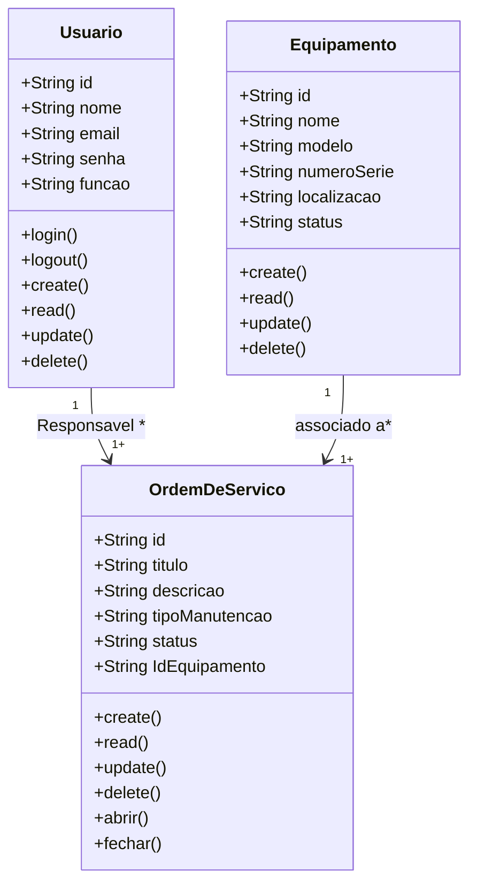

# Sistema de Gestão de Manutenção (Formativa)

## Briefing

### Visão Geral do Projeto
O projeto consiste no desenvolvimento de um Sistema de Gestão de Manutenção (SGM) no formato de uma aplicação web.

## Escopo

- ### Objetivos:

- ### Público-Alvo:
    - Técnicos de Manutenção
    - Gestores de Manutenção
    - Administradores do Sistema

- ### Recursos Tecnológicos:

## Diagramas (Mermaid, Miro, Draw.io)

1. ### Diagrama de Classes
Este Diagrama modela as principais entidades do sistema:
- Usuarios (User/usuarios);
- Maquinas/Equipamentos (Equipment);
- Ordem de Serviço (Service);

 #### Explicação do Diagrama de Classe
 - Um Usuário (Técnico) por ser responsável por várias Ordens de Servico
 - Um Equipamento por estar associado a várias Ordens de Serviço

 2. ### Diagrama de Caso de Uso
 Ilustrar as interações dos diferentes atores com o sistema. 

```mermaid
graph TD
    subgraph "SGM"
        caso1([Fazer Login])
        caso2([Gerenciar Ordens de Serviço - CRUD])
        caso3([Gerenciar Equipamentos - CRUD])
        caso4([Gerenciar Usuários - CRUD])
        caso5([Acessar o DashBoard])
        caso6([Gerar Relatórios])
        caso7([Atribuir Ordem de Serviço])
        caso8([Atualizar Status de Ordem])
        caso9([Pesquisar Equipamentos])
    end

    Tecnico([Técnico de Manutenção])
    Gestor([Gerente de Manutenção])
    Admin([Administrador do Sistema])
    Usuario([Usuário Comum])

    %% === Relacionamentos ===
    Tecnico --> caso1
    Tecnico --> caso2
    Tecnico --> caso3
    Tecnico --> caso5
    Tecnico --> caso8
    Tecnico --> caso9

    Gestor --> caso1
    Gestor --> caso2
    Gestor --> caso3
    Gestor --> caso5
    Gestor --> caso6
    Gestor --> caso7
    Gestor --> caso8

    Admin --> caso1
    Admin --> caso4
    Admin --> caso5
    Admin --> caso6

    Usuario --> caso1
    Usuario --> caso5
    Usuario --> caso3
```

